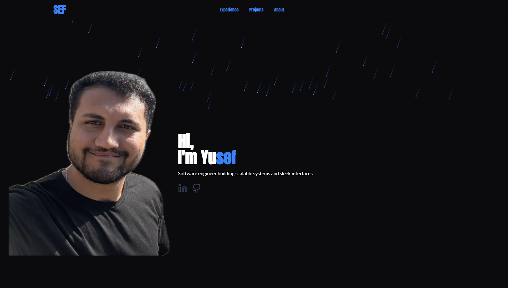

# SEF101.com | Portfolio Site for Yusef



This website showcases my skills and introduces me to employers. It also serves as a platform to host subpages for friends and family in the future.

---

## Features

### Interactive UI Components
- **3D Icon Cloud**: Highlights the technologies I use
- **Scratch-to-Reveal Elements**: Adds a fun, interactive touch
- **Animated Backgrounds**: Enhances visual appeal
- **Tech Skills Marquee**: Displays my skills in a scrolling format

### Project Showcase
- **Organized Layout**: Projects are easy to browse
- **Project Cards**: Includes images, descriptions, and links
- **Category Badges**: Highlights the technologies used in each project

---

## Technologies Used

### Framework
- **Next.js**: A modern React framework, utilizing React 19 and Tailwind v4

### Styling
- **Tailwind CSS**: For fast and flexible styling
- **shadcn/ui**: Ensures consistent design
- **Magic UI**: Simplifies creating interactive and dynamic elements

### Animations
- **Framer Motion**: For smooth and customizable animations

### Typography
- **Google Fonts**: Clean and professional font choices

### Icons
- **Lucide React**: Customizable and scalable icons

---

## Project Structure

### Key Directories
- **app/**: Main files for the site
- **components/**: Reusable UI components
- **public/**: Static assets like images

---

## Getting Started

To run the project locally:

```bash
npm run dev
```

Then, open [http://localhost:3000](http://localhost:3000) in your browser.